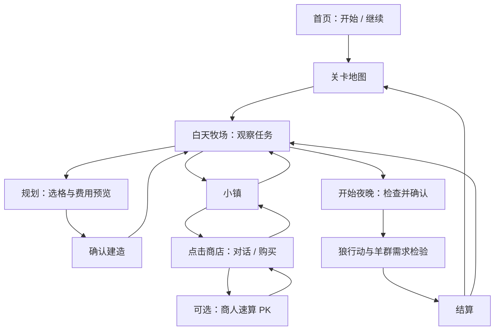

Here is the result of "fetch" for the Page with URL https://app.notion.com/p/3deed9e618178114adc7dbb75a8f4bd7 as of 2026-09-17T11:33:51.112Z:
<page url="https://app.notion.com/p/3deed9e618178114adc7dbb75a8f4bd7" icon="🐑">
<ancestor-path>
<parent-page url="https://app.notion.com/p/3a6ed9e6181781bb9c5ec92db9ae6631" title="一人公司创业工作台"/>
</ancestor-path>
<properties>
{"title":"晚安，羊羊｜正式研发版 V3 · 完整策划与低模剪纸美术"}
</properties>
<iconMetadata>{"type":"emoji","emoji":"🐑"}</iconMetadata>
<content>
<callout icon="🐑" color="green_bg">
	**正式研发版 V3｜低模剪纸视觉已确认。**
</callout>
<table_of_contents/>
# 01 产品定位与版本范围
玩家扮演小牧场主，通过选地、利用水岸、比较围栏与补给费用，保护小羊度过夜晚。数学直接参与决策：面积决定容量，周长影响造价，口算赢得物资折扣。
<table header-row="true">
<tr>
<td>项目</td>
<td>执行口径</td>
</tr>
<tr>
<td>核心循环</td>
<td>观察任务 → 规划牧场 → 核算费用 → 购买/挑战 → 确认建造 → 夜晚检验 → 结算优化</td>
</tr>
<tr>
<td>首个可玩版本</td>
<td>完整首页与关卡入口；前两关；选格自动围栏；草水商店；昼夜与狼；结算重玩；基础存档</td>
</tr>
<tr>
<td>完整首版</td>
<td>扩展至 8 关，加入多牧场、连通共享、商人速算 PK、轻量生态动效</td>
</tr>
<tr>
<td>后续扩展</td>
<td>小镇路遇朋友、商人小剧情、更多装饰；乘除法题型与正式微信小游戏适配单独评估</td>
</tr>
<tr>
<td>体验目标</td>
<td>每关约 3–8 分钟；主要靠点击与拖动；一次只引导一个新规则</td>
</tr>
</table>
# 02 玩家全流程与页面

<table header-row="true">
<tr>
<td>页面 / 状态</td>
<td>玩家操作</td>
<td>反馈与下一步</td>
</tr>
<tr>
<td>首页</td>
<td>点击开始游戏、继续游戏、设置</td>
<td>新玩家直接进入第一关引导；继续恢复最近白天状态。新开进度二次确认</td>
</tr>
<tr>
<td>关卡地图</td>
<td>点已解锁关卡卡片</td>
<td>展示目标、历史星级；进入后重置本关预算与物资；通关解锁下一关</td>
</tr>
<tr>
<td>首次进入牧场</td>
<td>读 1–2 句委托，点击小羊</td>
<td>小羊弹爱心并轻跳，状态卡显示面积、草、水需求；点“开始规划”</td>
</tr>
<tr>
<td>规划状态</td>
<td>点格子 / 拖动涂选，切换添加与擦除</td>
<td>高亮选地，预览栅栏；实时显示面积、周长、水岸抵扣、造价和缺口</td>
</tr>
<tr>
<td>建造确认窗</td>
<td>点确认建造 / 返回修改</td>
<td>确认后一次扣款，围栏逐段弹出；余额不足定位费用，不提交半成品</td>
</tr>
<tr>
<td>牧场观察</td>
<td>点小羊、牧场卡、草水资源</td>
<td>查看满意度与每个牧场需求；可重新规划或切换小镇</td>
</tr>
<tr>
<td>小镇</td>
<td>点商店建筑 / 返回牧场</td>
<td>镜头为固定小场景；商店高亮开窗，返回时保留牧场和账单</td>
</tr>
<tr>
<td>对话 / 商店</td>
<td>购买草料、水；点击商人挑战</td>
<td>显示数量、单价、合计、余额、折扣；购买成功库存立即更新</td>
</tr>
<tr>
<td>PK 入场 / 答题 / 结果</td>
<td>确认挑战，四选一答题</td>
<td>答题进度竞赛；结束回到原商店</td>
</tr>
<tr>
<td>开始夜晚确认窗</td>
<td>查看检查清单，点击入夜</td>
<td>未提交规划先选择建造、丢弃或取消；缺口明确提示，可返回调整或继续检验</td>
</tr>
<tr>
<td>夜晚</td>
<td>观看狼巡视与羊吃草喝水</td>
<td>暂停规划与购买；镜头短暂指向风险位置，结束进入结果窗</td>
</tr>
<tr>
<td>结算窗</td>
<td>下一关 / 再试一次 / 返回地图</td>
<td>展示通关原因、星级、费用拆分、是否使用折扣；失败可回到入夜前继续改</td>
</tr>
</table>
页面视觉采用第 10 节 V3 参考。
# 03 圈地、面积与围栏
<table header-row="true">
<tr>
<td>规则</td>
<td>定义</td>
</tr>
<tr>
<td>网格</td>
<td>逻辑采用正方形网格，每格面积 1，每条格边长 1；画面斜视不改变计算单位</td>
</tr>
<tr>
<td>选地</td>
<td>只选可用陆地。相邻上下左右连通；仅碰角不连通。水、山石、建筑禁选</td>
</tr>
<tr>
<td>面积 A</td>
<td>选中的有效陆地格数。每个牧场须满足 A ≥ 2 × 该牧场羊数</td>
</tr>
<tr>
<td>数学周长 P</td>
<td>所选陆地边界总长度，包含孔洞边界；内部共享边不计。P = 4A − 2E，E 为选中格之间的共享边数</td>
</tr>
<tr>
<td>水岸抵扣 W</td>
<td>选中陆地与水格正交相邻的边数。水格不计面积，水岸仍计数学周长</td>
</tr>
<tr>
<td>围栏长度 F</td>
<td>F = P − W；栅栏费用 = F × 每段单价。UI 同时显示“周长”“免建水岸”“需建栅栏”</td>
</tr>
<tr>
<td>山石边界</td>
<td>山石挡路且不能圈入；首版临山仍正常计栅栏，不另加抵扣例外</td>
</tr>
<tr>
<td>自动建造</td>
<td>沿全部应建边生成连续围栏，含孔洞；接角自动处理，内部边去掉。预览与结算使用同一份边界数据</td>
</tr>
<tr>
<td>地图边缘</td>
<td>视为普通边界，仍需栅栏；关卡有效地块外保留狼行动带，不能用屏幕边缘免费保护</td>
</tr>
</table>
**建造与修改。**每次确认提交完整的新方案，按新旧围栏费用差额扣款或退款；白天拆除按原实付返还。草稿只预览，不动账。取消恢复上次已建状态；夜晚开始后锁定方案。羊的逻辑位置以关卡出生格为准，闲逛动画不改变它属于哪个牧场。
# 04 多牧场与自然资源
每个上下左右连通的选地区域自动成为一个牧场，并编号 A、B……。无需玩家先建“牧场对象”；选中两处不相连区域即可形成两个牧场。
- **分别达标：**每个有羊的牧场单独核算容量、草料、水和安全；不能用 A 的大面积弥补 B 的拥挤。
- **自然草：**每个牧草格提供 1 份草；普通土地、装饰草和小花不产出。牧草格必须有清楚的叶片标识。
- **自然水：**牧场有至少一条有效水岸，即满足该牧场本夜全部饮水需求；不同牧场不能远程共享同一处水岸。
- **连接通道：**选中连续陆地绕过山石，两个牧场合并，重新计算整个边界并共享自然草水；通道算面积，也可能增加围栏。
- **已购库存：**购买的草、水可分配给任意牧场；自然资源只能在各自连通牧场内使用。系统按编号顺序自动补足缺口，库存不足时显示具体未满足牧场。
- **空牧场：**允许规划没有羊的区域，但其自然资源不能供给别处；连通后才能共享。每只任务羊都必须被纳入某个牧场。
**惊喜来自总账。**示意：A 牧场有水、缺 4 份草；B 有富余草、缺水。分开需要 8 金币草料和 4 金币水。如果连接后额外围栏为 8 金币且资源足够，就能少花 4 金币。拿到五折后补给只需 6 金币，分开反而更划算。此例用于说明经济权衡，实际关卡按地图逐边计算。
# 05 经济、库存与商店
<table header-row="true">
<tr>
<td>项目</td>
<td>首轮数值</td>
<td>记账方式</td>
</tr>
<tr>
<td>每只羊的本夜需求</td>
<td>面积 2 格、草 2 份、水 1 份</td>
<td>面积为容量；草水在本次夜晚成功结算时消耗</td>
</tr>
<tr>
<td>围栏</td>
<td>1 金币 / 段</td>
<td>按需建栅栏长度结算，口算折扣不适用</td>
</tr>
<tr>
<td>草料</td>
<td>2 金币 / 份</td>
<td>按份购买，购买后进入全局草料库存</td>
</tr>
<tr>
<td>水</td>
<td>4 金币 / 桶，每桶 4 份</td>
<td>整桶购买，库存按份显示，可分给不同牧场；总缺水 5 份须买 2 桶</td>
</tr>
<tr>
<td>自然供给</td>
<td>牧草格 1 份 / 格；临水牧场饮水满足</td>
<td>每关按一个夜晚设计，不叠加每日产出</td>
</tr>
<tr>
<td>关卡资金</td>
<td>每关固定初始预算</td>
<td>重玩恢复关卡初值；不跨关继承金币与补给，便于比较解法</td>
</tr>
<tr>
<td>口算奖励</td>
<td>草料、水五折</td>
<td>草料 1 金币 / 份，水 2 金币 / 桶；只对获胜后本关内的购买生效，不叠加</td>
</tr>
<tr>
<td>通关奖励</td>
<td>星级与下一关解锁</td>
<td>不出售金币；不靠失败反复领取资金</td>
</tr>
</table>
**统一账单。**总支出 = 当前围栏实付 + 未退款的草水采购实付；余额 = 初始金币 − 总支出。所有修改先展示差额，确认才写账。补给多买仍计成本，不因未分配而隐藏支出。
**库存显示。**顶栏显示金币余额、购买草料库存、购买水库存；点击展开“已分配 / 剩余”。自然供给只显示在牧场卡中，避免把免费供给误认为可带走库存。资源不足使用图标与文字同时提示。
**商店操作。**点商品 → 加减数量 → 查看总价与可负担状态 → 确认购买 → 库存动效 → 留在商店。草、水各一张商品卡；商人可点击开启对话或 PK。
**退货。**白天允许退回未消耗物资，按对应购买批次的实际单价退款；自动分配先释放，库存重新分配。折扣不追溯原价购买；不能折扣买入、原价退回。资源账单保留购买、退款记录。
**摆放。**补给分配后，牧场里自动出现草篮或水槽；首版不要求另买容器、不占用面积。草捆和草篮为同一种草料的图标与场景表现。
# 06 商人速算 PK
**入口顺序：商店点商人 → 规则与挑战按钮 → VS 条 → 四选一答题 → 胜负与折扣 → 原商店。**商人头像固定在左，玩家在右。
<table header-row="true">
<tr>
<td>关卡/练习档</td>
<td>题型</td>
<td>商人完成 5 题的目标时间</td>
</tr>
<tr>
<td>初级（第 6 关）</td>
<td>20 以内加减，结果为非负整数</td>
<td>30 秒</td>
</tr>
<tr>
<td>进阶（第 7 关）</td>
<td>两位数加减</td>
<td>25 秒</td>
</tr>
<tr>
<td>综合（第 8 关）</td>
<td>两位数混合加减，可少量进退位</td>
<td>22 秒</td>
</tr>
<tr>
<td>后续题库</td>
<td>三位数加减、两位数乘除，除法整除，比大小等</td>
<td>另行试玩标定，不纳入首版验收</td>
</tr>
</table>
前两关直接体验围地和采购，第 6 关再正式引入口算奖励；早期开发可提供独立 PK 测试入口。**所有关卡须能在不获得折扣时通关。**折扣用于发现新解法，不作为卡关门槛。
# 07 昼夜、狼与结算
**白天。**羊轻微闲逛、低头吃草；纸片草叶摆动，蝴蝶在小范围飞行。点击羊出现爱心与咩声；点击景物触发一次轻摇或飞起。规划时降低装饰对比度，选格与边界最清楚。
**入夜。**玩家点击“开始夜晚”后进入约 10 秒的演出；天色从暖色转为蓝紫，窗灯亮起，蝴蝶离场。所有判定先由确定性规则计算，演出负责说明结果。
<table header-row="true">
<tr>
<td>狼状态</td>
<td>行为与判定</td>
</tr>
<tr>
<td>出现</td>
<td>从关卡定义的地图外侧入口走入，不能在牧场内部生成</td>
</tr>
<tr>
<td>寻找</td>
<td>四方向寻路检测通往任意羊所在格的路径；栅栏边、水格、山石与建筑阻挡，不能斜穿角</td>
</tr>
<tr>
<td>存在可达羊</td>
<td>优先最近的可达羊，同距离按固定编号选择；走近后羊受惊，标记具体风险格，本次安全失败</td>
</tr>
<tr>
<td>无可达羊</td>
<td>沿围栏外围短距离巡逻、嗅闻或疑惑，随后离开；不跳栏、不拆栏、不攻击水岸</td>
</tr>
<tr>
<td>没有可巡逻路径</td>
<td>在出生区域嗅闻后离开，不强行穿过障碍；安全依旧由寻路结果决定</td>
</tr>
</table>
**通关需同时满足：**全部任务羊在已建牧场中；每个牧场面积足够；草水分配足够；狼到不了任何羊；金币余额非负。结果不能只看围栏是否画成闭环。
**失败展示：**优先指向安全风险，其次拥挤、缺草、缺水；显示“哪只羊 / 哪个牧场 / 还差多少”。回到入夜前状态继续修改，不重复扣草水，不重新收取已建围栏费用。
**成功展示：**狼离开 → 羊吃草喝水 → 安心睡下 → 结算卡。只在成功时一次性提交消耗与成绩；退出/刷新不重复结算。
**评分。**通过即至少 1 星；在关卡支出阈值内获得 2、3 星。失败不授星。结算显示面积、周长、免建水岸、围栏费、补给费、节余及折扣状态；PK 成绩独立记录，不用答题速度降低牧场星级。最佳支出区分“原价 / 折扣”，避免混比。
# 08 关卡设计
**坐标统一。**左上为 (1,1)，x 向右、y 向下。图中 S 为羊所在的牧草格，g 为牧草格，点为普通土地，W 为水格。下列数值为执行样例；两关均未启用 PK。
## 第 1 关｜给两只羊一个家
委托：“今晚有点凉，给我们围一个能睡觉的小院吧。”
```plain text
x 123456
1 ......
2 ..gg..
3 ..SS..
4 ......
5 ......
```
<table header-row="true">
<tr>
<td>配置</td>
<td>内容</td>
</tr>
<tr>
<td>目标 / 初始预算</td>
<td>2 只羊；面积至少 4；草 4 份；水 2 份；16 金币；购买库存为 0</td>
</tr>
<tr>
<td>引导节奏</td>
<td>点羊看需求 → 点第一格 → 补齐 4 格 → 确认围栏 → 发现缺水 → 去商店买 1 桶 → 返回入夜</td>
</tr>
<tr>
<td>参考选地</td>
<td>x=3–4，y=2–3，形成 2×2 牧场；A=4、P=8、W=0、F=8</td>
</tr>
<tr>
<td>供给 / 支出</td>
<td>自然草 4；买水 1 桶得 4 份；围栏 8 + 水 4 = 12 金币，结余 4</td>
</tr>
<tr>
<td>评分</td>
<td>通关且支出 ≤12 为 3 星；≤14 为 2 星；≤16 为 1 星</td>
</tr>
<tr>
<td>狼演出</td>
<td>从左侧入口接近，在围栏外停留后离开；若漏圈羊则高亮对应羊格</td>
</tr>
<tr>
<td>学习点</td>
<td>面积不是周长；紧凑形状控制围栏费；圈住后还要补水</td>
</tr>
</table>
## 第 2 关｜借一段水岸
委托：“池塘能供水，也能帮我们省一段栅栏。”
```plain text
x 12345678
1 ........
2 ........
3 .gSSgW..
4 .gSSg...
5 ........
6 ........
```
<table header-row="true">
<tr>
<td>配置</td>
<td>内容</td>
</tr>
<tr>
<td>目标 / 初始预算</td>
<td>4 只羊；面积至少 8；草 8 份；水 4 份；24 金币；购买库存为 0</td>
</tr>
<tr>
<td>引导节奏</td>
<td>展示水岸规则 → 自由选地 → 对比面积相同的方案 → 确认 → 入夜</td>
</tr>
<tr>
<td>参考方案 A：竖条</td>
<td>选 x=3–4，y=2–5；A=8、P=12、W=0、F=12；自然草 4，无临水</td>
</tr>
<tr>
<td>方案 A 费用</td>
<td>围栏 12 + 补草 4×2 + 水 1 桶×4 = 24 金币</td>
</tr>
<tr>
<td>参考方案 B：横向</td>
<td>选 x=2–5，y=3–4；A=8、P=12；右上边邻 W(6,3)，W=1、F=11；自然草 8，饮水满足</td>
</tr>
<tr>
<td>方案 B 费用</td>
<td>围栏 11 + 补给 0 = 11 金币；水格未被选入，面积仍为 8</td>
</tr>
<tr>
<td>评分</td>
<td>通关且支出 ≤11 为 3 星；≤16 为 2 星；≤24 为 1 星</td>
</tr>
<tr>
<td>狼演出 / 学习点</td>
<td>沿东侧靠近但不跨水；水岸计周长、免栅栏，同时省下饮水采购</td>
</tr>
</table>
以上参考解是可行解，星级以这些方案为首轮标尺；不宣称已穷举全局最优解。
## 完整首版的关卡递进
<table header-row="true">
<tr>
<td>关卡</td>
<td>新增内容</td>
<td>必须形成的决策</td>
</tr>
<tr>
<td>1 给羊一个家</td>
<td>面积、围栏、采购、夜晚</td>
<td>够住与够吃喝同时满足</td>
</tr>
<tr>
<td>2 借一段水岸</td>
<td>水岸抵扣与自然水</td>
<td>相同面积与周长，地理位置仍改变总价</td>
</tr>
<tr>
<td>3 草在哪里</td>
<td>分散牧草</td>
<td>多围几格取草，还是直接买草</td>
</tr>
<tr>
<td>4 山的两边</td>
<td>禁选山石、两个牧场</td>
<td>各自满足面积与需求，不能只看总量</td>
</tr>
<tr>
<td>5 连成一家</td>
<td>绕山陆地通道</td>
<td>增加栅栏但共享资源，比较总账</td>
</tr>
<tr>
<td>6 商人的挑战</td>
<td>四选一加减法 PK</td>
<td>原价也能过，挑战提供另一种省钱路线</td>
</tr>
<tr>
<td>7 今天有折扣</td>
<td>布局与折扣共同作用</td>
<td>连接方案与分别补给的经济优劣反转</td>
</tr>
<tr>
<td>8 晚安大草原</td>
<td>全部基础机制组合</td>
<td>自行规划、核算与优化，解释为何这样圈</td>
</tr>
</table>
第 3–8 关为关卡目标稿：正式排图后再锁定预算、出生格、资源格和星级。每关至少验证一条原价可行解；第 5、7 关需实际验证两种布局的费用差与反转，不能只靠剧情宣称。
# 09 UI 规格与状态
<table header-row="true">
<tr>
<td>界面资源</td>
<td>必要信息与动作</td>
<td></td>
</tr>
<tr>
<td>资源栏</td>
<td>金币、购买草库存、购买水库存；草水加号进入商店；金币位置点开账单，不显示充值入口</td>
<td></td>
</tr>
<tr>
<td>牧场卡片</td>
<td>编号、羊数、面积当前/需求、自然草、已分配草水、缺口、安全状态；点卡片定位牧场</td>
<td></td>
</tr>
<tr>
<td>规划卡片</td>
<td>面积、数学周长、免建水岸、栅栏段数、改建差价；添加、擦除、撤销、重做、确认</td>
<td></td>
</tr>
<tr>
<td>对话框</td>
<td>人物头像、名字、最多两行正文、继续/关闭；首段引导外不阻挡再次操作</td>
<td></td>
</tr>
<tr>
<td>商店窗</td>
<td>商人形象、草水商品、数量、原价/折后价、合计、余额、购买、退货、挑战、关闭</td>
<td></td>
</tr>
<tr>
<td>确认窗</td>
<td>动作说明、费用变化、风险列表；主动作和取消，按钮措辞具体</td>
<td></td>
</tr>
<tr>
<td>PK 页</td>
<td>双方头像、5 格进度、当前算式、四个选项、剩余比赛进度、退出；答题区最大</td>
<td></td>
</tr>
<tr>
<td>结算窗</td>
<td>通关/待改进、星级、费用拆分、资源达标、折扣标记、下一关/修改/重玩</td>
<td></td>
</tr>
<tr>
<td>场地切换 / 设置</td>
<td>牧场与小镇两个目的地；设置含音量、音乐、减弱动效、返回首页</td>
<td></td>
</tr>
</table>
**显示规范。**横屏固定斜视，UI 使用纸卡与木色边框；正文和数字由引擎渲染，不能烘焙在图片里。常规操作按钮触控区域至少 44×44 逻辑像素；小屏收折侧卡但保留选地与确认。选中、禁选、缺资源同时用边框、图标、文字区分，避免只靠颜色。夜间保证格子和账单可读。
# 10 V3 正式美术基准与素材全集
## 10.0 统一视觉原则
- 固定等距/斜俯视，少量清楚的多边形折面，哑光平涂、柔和投影。
- 主色为奶油白、浅草绿、鼠尾草绿与淡木色；夜晚用深蓝绿与暖灯，冬季用浅雪色和暖窗。
- 羊群、人物、建筑共享低模剪纸语言；避免卷纸毛发、写实纸纤维或黏土质感。
- 牧场地图为主，UI 沿边缘放置，保持格线、选区、水岸和围栏可辨；大牧场先拉远镜头。
- 同一主题的朝向、动作、表情和昼夜季节统一在一张图中展示。
**交付层级：**以下为 PNG 视觉设定和页面状态图，尚未拆为透明精灵、连续动画、GLB 模型或原生 UI 组件。Godot 中的文字、数值、禁用状态和命中区域需要单独实现。
## 10.1 小羊形态合集
同一只羊的多朝向、吃草、喝水、受惊、睡觉与被摸头状态。后续模型与动画以此锁定轮廓和配色。

## 10.2 人物动作表情合集
草帽、奶油衬衣、绿色背带裤为人物识别特征；对话和 PK 头像复用同一身份。

## 10.3 商人动作表情合集
商人使用棕发与绿色围裙，欢迎、递货、算账、思考、庆祝及头像表情统一制作。

## 10.4 小狼动作合集
蓝灰配色、尖耳与长尾为正式造型方向；使用探头、行走、嗅闻、惊讶和离开等非暴力演出。

## 10.5 摸羊互动动作定格
六个互动定格供动画制作参考；点击羊后的反馈仍以短动作、爱心和咩声为主，互动不移动羊的逻辑出生格。

## 10.6 商店昼夜四季合集
同一店铺的春夏秋、白天、夜晚、冬季变化；保留屋顶、柜台、招牌与窗口的建筑识别特征。

## 10.7 小镇建筑配件合集
柜台、路面、羊形招牌、遮阳棚、花箱、路灯和长凳拆为复用模块。

## 10.8 牧场地形围栏合集
普通地、产草地、水岸、雪地、山石、围栏与门的造型参考。水与障碍禁选；水岸只减栅栏，不减数学周长。

## 10.9 自然与物资合集
装饰草花蝴蝶、季节树木及草料、水桶、水槽。装饰草不产出；功能牧草必须有明确标识。

## 10.10 牧场游戏UI状态合集
规划、确认预览、守夜、冬季四状态。正式实现需让全部任务羊处于有效牧场；图中位置、格子数和金额仅是视觉示意。

## 10.11 商店UI状态合集
采用店铺与老板配套的商品浏览、数量选择、不足、成功四状态。正式商店仅卖草料和水：本图的围栏商品展示需移除，价格改为第 05 节配置，并补上商人挑战与退货入口；余额不足时所有不可负担商品均禁用购买。

## 10.12 口算PK页面状态合集
开场、答题、答对、结果四状态。商人在左，玩家在右；实际答题界面缩小人物为头像，让算式和四选一占主区域。结果奖励为本关草水五折，不采用图示奖杯作为新增玩法。

## 10.13 通用UI与结算合集
资源条、状态卡、规划卡、对话、确认、结算和按钮状态的样式参考。图中的木材资源与金币/草水奖励不纳入正式规则；确认窗只显示真实费用，结算使用星级与解锁。面积用格、周长用边长单位，围栏费用依真实边界计算。

## 10.14 牧场昼夜四季场景合集
同一牧场的昼夜与季节气氛。此图每景五只羊，属于场景设定；关卡羊数以关卡数据为准。冬季先作为视觉换装，不自动引入冻水、减产等机制。

## 10.15 研发交付检查
- [x] 人物、小羊、商人、小狼造型及表情动作方向统一。
- [x] 商店与牧场昼夜、季节，以及主要页面状态已提供视觉参考。
- [ ] 制作模型/透明资源并统一比例、轴心、命名和碰撞范围。
- [ ] 把摸羊等定格制作成连续动画，验证不遮挡规划操作。
- [ ] 商店和通用 UI 按第 05、09 节校正商品、价格、奖励与资源种类。
- [ ] 补齐首页、关卡地图、设置与失败详情的原生页面。
- [ ] 接入真实面积、周长、草水、金币与狼判定，完成 Web 导出试玩。
# 11 实现方案、数据与存档
**采用 Godot + Blender 的轻量 2.5D 方案。**玩法用二维格子、边界与连通关系计算；呈现使用固定正交相机、低模纸艺场景和 2D UI。UI 与角色头像保持 2D；草、花、蝴蝶可用平面纸片。镜头首版不旋转，减少视角遮挡与额外美术量。
<table header-row="true">
<tr>
<td>模块</td>
<td>职责与边界</td>
</tr>
<tr>
<td>Grid / Level</td>
<td>地形、羊出生格、资源供给、禁选格、狼入口、初始预算、星级阈值</td>
</tr>
<tr>
<td>Planner</td>
<td>选格、撤销、连通区域、面积/周长/水岸/围栏；输出同一份预览与提交数据</td>
</tr>
<tr>
<td>Economy / Supply</td>
<td>金币、购买批次、退款、折扣、牧场自动分配；以一次事务提交，避免重复扣款</td>
</tr>
<tr>
<td>Night Resolver</td>
<td>按已提交方案检测狼可达性、面积与草水；生成成功/失败原因供动画播放</td>
</tr>
<tr>
<td>Town / Shop / PK</td>
<td>场地切换、商店购物与口算；离开商店不丢牧场草稿和当前进度</td>
</tr>
<tr>
<td>Presentation / UI</td>
<td>自动拼接围栏、纸艺灯光、昼夜、生态、卡片与动画；不自行计算另一套费用</td>
</tr>
<tr>
<td>Save</td>
<td>关卡解锁、最好成绩</td>
</tr>
</table>
**资产流程。**选定参考 → Blender 低模与纸层材质 → 统一单位、脚底轴心、纹理尺寸与命名 → 导出 GLB → Godot 导入 → 绑定网格与动画。不是把整张生图直接当成可操作场景。
**网页基线。**使用 GDScript、Compatibility 渲染器与单线程 Web 导出作为首版测试起点。预烘焙主要明暗，少量实时光照，控制贴图、透明层、模型数量与特效。先验证目标教室电脑浏览器，再逐步添加生态。移动端网页另测触控与屏幕适配；网页可打开不代表已完成正式微信小游戏适配。
**保存时机。**挑战结束、关卡成功后自动保存
**外部技术依据：**[Godot Web 导出](https://docs.godotengine.org/en/stable/tutorials/export/exporting_for_web.html)、[3D 场景导入格式](https://docs.godotengine.org/en/stable/tutorials/assets_pipeline/importing_3d_scenes/available_formats.html)、[Camera3D](https://docs.godotengine.org/en/stable/classes/class_camera3d.html)。具体 Godot 版本在原型阶段固定，性能以真实导出测试为准。
- [ ] 第一格点击立即反馈；观察、规划、弹窗之间没有误触穿透。
- [ ] 2×2 四格周长为 8；相邻合并去掉内部边；斜角不合并；孔洞边界正常计入。
- [ ] 第二关横向参考方案面积 8、周长 12、水岸 1、栅栏 11，总支出 11。
- [ ] 每只羊都有归属；多牧场分别达标；连通与拆开实时重算，不重复分配库存。
- [ ] 原价/折扣采购、退款、改建、取消、刷新后的金币与物资一致，不能刷钱。
- [ ] 四个答案不同且只有一个正确；错答不涨进度，退出不领奖，折扣不叠加。
- [ ] 狼不会穿栏、跨水、斜穿角；失败明确定位原因；重复播放不重复消耗。
- [ ] 前两关原价可通关；后续每关锁定地图时附可行解与完整账单。
- [ ] 字体、触控、弹窗边界、夜间格线可读；减弱动效不影响数学反馈。
- [ ] 本版 15 张参考均可查看；正式 UI 数字与按钮状态由游戏逻辑驱动，美术图不定义数值规则。
**下一轮需要通过试玩锁定的内容：**第 3–8 关地图与预算、商人速度、最终折扣力度、目标设备性能。狼造型已采用第 10 节 V3 参考。本文已给出可制作的全流程和默认规则，待验证项集中调整，不影响前两关先落地。
# 12 后续大型牧场游戏效果｜23 只羊
下图展示二十余只羊时的大牧场规模感：23 只羊分为四组（上方 5 只，其余每组 6 只），保留等距视角、细网格、轻量边缘 UI 与低模剪纸语言。镜头比基础关卡更远，羊群、草料与围栏仍可辨认。
大型牧场属于后续规模展示，不扩大前两关首个可玩版本的验收范围。正式关卡需要另行验证地块连通、水岸供水、所有羊的安全与预算；概念图中的围栏连接、金币和“充足”提示不代表已验证可行解。按现行规则，23 只羊至少需要 46 格有效陆地、46 份草料与 23 份饮水，需求仍须按每个连通牧场分别核算。

</content>
</page>
